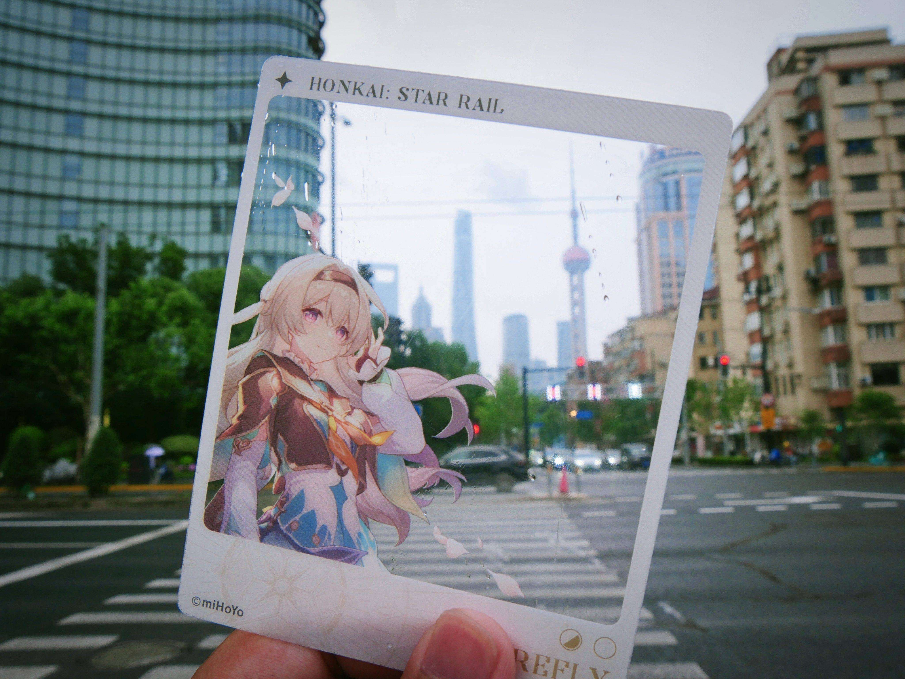

English | [中文](./readme-zh.md)

### Programming tools

### Technology stack

 

-----

### Who Am I

Major in physics, photoelectric information science and engineering

aka：[Optical Engineering](https://en.wikipedia.org/wiki/Optical_engineering)、[Optoelectronics](https://en.wikipedia.org/wiki/Optoelectronics)、[Computer Vision](https://en.wikipedia.org/wiki/Computer_vision)

Other works：[My projects](https://github.com/nenekodev?tab=repositories)、[My photography](https://nenekodev.tuchong.com/)

### Contact Me

-----

### Statistics

### Something Else

[For detailed statistics](./dashboard.md)

[neneko.dev](https://neneko.dev)[zh-cn][WIP]

